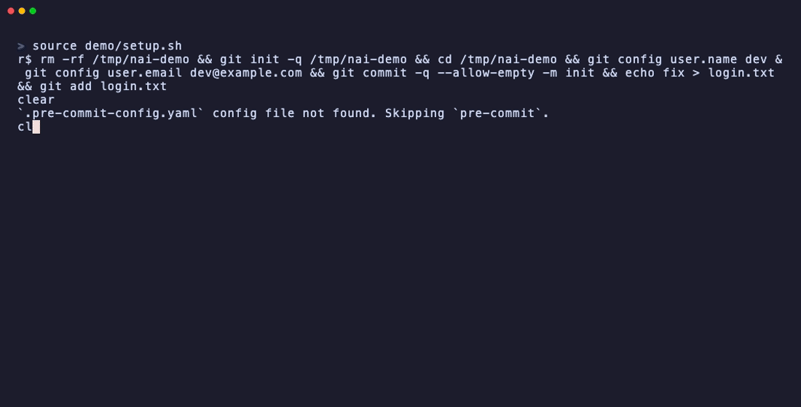
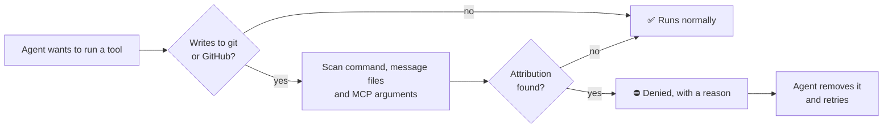

<div align="center">

# 🚫🤖 no-ai-attribution

**Your commits. Your name. No robot footers.**

A tiny hook plugin that stops AI coding agents from stamping
`Co-Authored-By: Claude` / `Copilot` / `Cursor` trailers and
*"🤖 Generated with …"* footers into your git history, pull requests, and issues.

[](https://github.com/the-mentor/no-ai-attribution/releases/latest)
[](LICENSE)


**Works with** Claude Code · OpenAI Codex CLI · GitHub Copilot CLI · Qoder

</div>

---

## ✨ What it looks like

<p align="center"></p>

Your agent tries to sneak a footer into a commit:

```console
$ git commit -m "fix login redirect" -m "Co-Authored-By: Claude <noreply@anthropic.com>"
```

The hook catches it before the command ever runs:

```text
⛔ Blocked: this command contains AI-assistant attribution (e.g. a
   Co-authored-by trailer or 'Generated with' footer), which is not allowed
   in commits, PRs, and issues. Remove the attribution and retry.
```

The agent reads that, drops the footer, and commits again. You get a clean
history without having to say a word. 🧹

## 🤔 Why?

Many agents add attribution by default. You can ask them not to in a
`CLAUDE.md` or `AGENTS.md`, but then the agent has to *remember*, every
single time, across every session. Sooner or later one slips through and
lives in your history forever.

**no-ai-attribution doesn't ask. It enforces.** It runs as a `PreToolUse`
hook, so the check happens *before* the command executes, no matter what the
agent was told or forgot.

- ⚡ **Instant.** Pure Python standard library, runs in milliseconds.
- 🪶 **Tiny.** One script, zero dependencies, nothing to `pip install`.
- 🎯 **Precise.** Only looks at commands that write to git or GitHub. Your
  `grep`, `git log`, and reads are never touched.
- 🔁 **Self-correcting.** The agent gets a clear reason and fixes it itself.

## 🎯 What it catches

| Where | Examples |
|---|---|
| **Git** | `git commit`, `merge`, `tag`, `notes`, `revert`, `cherry-pick`, even with options like `git -c user.name=… commit` or `git -C dir commit` |
| **GitHub CLI** | `gh pr` / `gh issue` create · edit · comment · review · merge, `gh release create/edit`, `gh api` |
| **Message files** | `-F msg.txt`, `--file`, `--body-file`, `--notes-file`, `field=@file`. It reads the file, following any `cd` in the command |
| **GitHub MCP tools** | Any GitHub MCP write tool (create PR, comment, push files…). Every text argument is checked |

**Patterns it blocks:**

| Agent | What gets caught |
|---|---|
| **Claude Code** | `Co-Authored-By: Claude`, *"Generated with Claude Code"*, `claude.com/claude-code`, `noreply@anthropic.com`, mentions of Anthropic or Claude Code |
| **OpenAI Codex** | `Co-Authored-By: Codex`, *"Generated with Codex"*, `noreply@openai.com`, mentions of OpenAI Codex |
| **GitHub Copilot** | `Co-authored-by: Copilot`, and its `Copilot@users.noreply.github.com`, `Copilot[bot]@users.noreply.github.com`, and `copilot@github.com` addresses |
| **Cursor** | `Co-authored-by: Cursor`, `cursoragent@cursor.com` |
| **Gemini** | `Co-authored-by: Gemini`, `gemini-code-assist[bot]` |
| **Aider** | `Co-authored-by: aider`, `noreply@aider.chat` |

For Copilot, Cursor, Gemini, and Aider, the name only counts as a
co-author trailer, so ordinary commits like *"fix Cursor keybinding"* or
*"bump gemini SDK"* go through.

## 🚀 Install

> **Needs:** `python3` (3.10 or newer) on your `PATH`, including the non-interactive shell your
> agent uses (pyenv/Nix users, double-check this one).

<details open>
<summary><b>Claude Code</b></summary>

Send these as **two separate prompts**, one at a time:

```
/plugin marketplace add the-mentor/no-ai-attribution
```

```
/plugin install no-ai-attribution@no-ai-attribution
```

Local checkout instead? `claude --plugin-dir /path/to/no-ai-attribution`
</details>

<details>
<summary><b>OpenAI Codex CLI</b></summary>

```bash
codex plugin marketplace add the-mentor/no-ai-attribution
codex plugin add no-ai-attribution@no-ai-attribution
```

Codex asks you to trust non-managed plugin hooks once. Approve it under `/hooks`.
</details>

<details>
<summary><b>GitHub Copilot CLI</b></summary>

```bash
copilot plugin marketplace add the-mentor/no-ai-attribution
copilot plugin install no-ai-attribution@no-ai-attribution
```
</details>

<details>
<summary><b>Qoder CLI</b></summary>

```bash
git clone https://github.com/the-mentor/no-ai-attribution
qoder plugins install ./no-ai-attribution
```
</details>

**Updating:** `/plugin update no-ai-attribution`, then `/reload-plugins` (a
running session keeps its old hooks until it reloads).

## 🧠 How it works



The hook reads the tool call the agent is about to make. If it's a git or
GitHub write, it scans the full command line, any message files it
references, and (for MCP tools) every string argument. A match returns
`permissionDecision: deny` with exit code 2. Anything else passes through
untouched.

## ⚠️ Good to know

- **It's strict on purpose.** The whole command line is scanned, so a footer
  anywhere in a chained command (e.g. after `&&`) blocks the git write it's
  chained to.
- **It targets defaults, not adversaries.** Deliberately disguised text
  (`Cl""aude`, `$(printf …)`) isn't detected. The goal is stopping the footers
  agents add automatically.
- **Copilot CLI:** only shell commands are checked there. MCP tools aren't
  matched on that host.
- **No `python3`, no protection.** If the hook can't run, Claude Code and Qoder
  let commands through unchecked, and Copilot CLI blocks every shell command.

## 🧪 Development

```bash
uv run --no-project python -m unittest discover -s tests
```

or, without uv:

```bash
python3 -m unittest discover -s tests
```

Every bypass ever found has a regression test.

## 📄 License

[MIT](LICENSE) © Avri Chen-Roth

<div align="center">

**If this saved your git history, drop a ⭐. It helps others find it.**

</div>

## ⭐ Star history

<a href="https://star-history.com/#the-mentor/no-ai-attribution&Date">
  <picture>
    <source media="(prefers-color-scheme: dark)" srcset="https://api.star-history.com/svg?repos=the-mentor/no-ai-attribution&type=Date&theme=dark" />
    <source media="(prefers-color-scheme: light)" srcset="https://api.star-history.com/svg?repos=the-mentor/no-ai-attribution&type=Date" />
    
  </picture>
</a>
